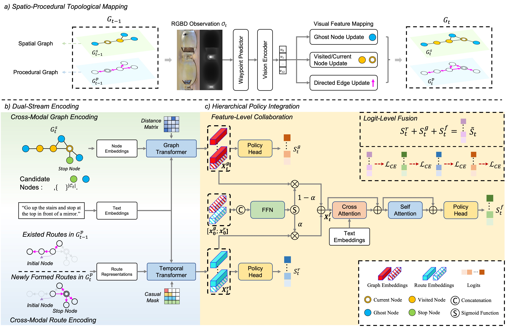

# Collaborative Map-based and Route-based Policy Learning for Continuous Vision-and-Language Navigation

This repository is the official implementation of: Collaborative Map-based and Route-based Policy Learning for Continuous Vision-and-Language Navigation

> Vision-and-Language Navigation in Continuous Environments (VLN-CE) requires agents to follow language instructions to reach targets in unseen 3D environments, demanding both spatial reasoning and procedural alignment during cross-modal planning. Existing methods typically emphasize only one of these abilities: map-based policies support spatial reasoning via graph representations, while route-based policies favor procedural alignment by matching sequential observations with instructions. Studied in isolation, such policies limit effective planning in complex scenes. Inspired by human navigation, we propose a collaborative policy learning framework that integrates both capabilities. Our framework comprises Spatio-Procedural Topological Mapping to build a multiplex graph, Dual-Stream Encoding for parallel cross-modal reasoning, and Hierarchical Policy Integration that fuses the two policies at feature and logit levels. Extensive experiments on VLN-CE benchmarks demonstrate the effectiveness of our approach.

## TODO

- [x] Release evaluation model checkpoints and evaluation code for CoMaRETPNav.
- [x] Release evaluation model checkpoints and evaluation code for CoMaRg3D-LF.
- [ ] Release training pipeline and training code for CoMaRETPNav.
- [ ] Release training pipeline and training code for CoMaRg3D-LF.
- [ ] Release real-world deployment code on the Unitree robot dog.

