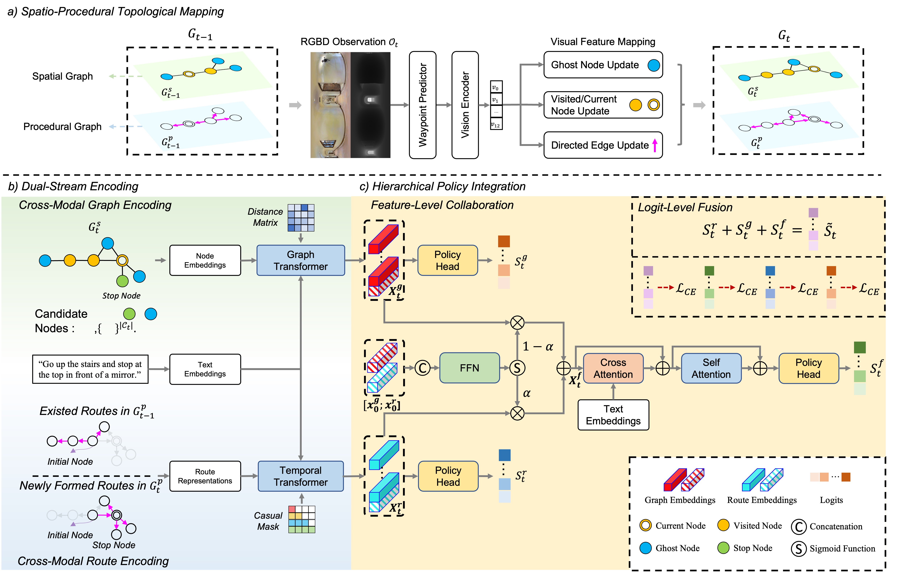

# Collaborative Map-based and Route-based Policy Learning for Continuous Vision-and-Language Navigation

This repository is the official implementation of: Collaborative Map-based and Route-based Policy Learning for Continuous Vision-and-Language Navigation

> Vision-and-Language Navigation in Continuous Environments (VLN-CE) requires agents to follow language instructions to reach targets in unseen 3D environments, demanding both spatial reasoning and procedural alignment during cross-modal planning. Existing methods typically emphasize only one of these abilities: map-based policies support spatial reasoning via graph representations, while route-based policies favor procedural alignment by matching sequential observations with instructions. Studied in isolation, such policies limit effective planning in complex scenes. Inspired by human navigation, we propose a collaborative policy learning framework that integrates both capabilities. Our framework comprises Spatio-Procedural Topological Mapping to build a multiplex graph, Dual-Stream Encoding for parallel cross-modal reasoning, and Hierarchical Policy Integration that fuses the two policies at feature and logit levels. Extensive experiments on VLN-CE benchmarks demonstrate the effectiveness of our approach.



## TODO

- [x] Release evaluation model checkpoints and evaluation code for CoMaR<sub>ETPNav</sub> on R2R-CE datasets.
- [x] Release evaluation model checkpoints and evaluation code for CoMaR<sub>g3D-LF</sub> on R2R-CE datasets.
- [x] Release training pipeline and training code for CoMaR<sub>ETPNav</sub> on R2R-CE datasets.
- [x] Release training pipeline and training code for CoMaR<sub>g3D-LF</sub> on R2R-CE datasets.
- [x] Release real-world deployment code on the Unitree robot dog.


## Requirements

To set up the conda environment, please follow the guidelines provided by the baseline methods: [ETPNav](https://github.com/MarSaKi/ETPNav) and [g3D-LF](https://github.com/MrZihan/g3D-LF). Configuring the environment for these baselines is sufficient to meet all the requirements for CoMaR; no additional dependencies are needed. For your convenience, we also provide a ready-to-use environment configuration file: `env.yml`. Specifically, the environment setup process of the baselines is as follows:

#### 1. Install Habitat Simulator:
Follow the installation instructions from [ETPNav](https://github.com/MarSaKi/ETPNav) or the original [VLN-CE](https://github.com/jacobkrantz/VLN-CE) repository.

#### 2. Install `torch_kdtree` (Required for g3D-LF):
For K-nearest feature search in g3D-LF, install `torch_kdtree` from the [official repository](https://github.com/thomgrand/torch_kdtree):
```bash
git clone https://github.com/thomgrand/torch_kdtree
cd torch_kdtree
git submodule init
git submodule update
pip3 install .

```

#### 3. Install `tinycudann` (Required for g3D-LF):
For faster multi-layer perceptrons (MLPs) in g3D-LF, install `tinycudann` from [tiny-cuda-nn](https://github.com/NVlabs/tiny-cuda-nn):

```bash
pip3 install git+https://github.com/NVlabs/tiny-cuda-nn/#subdirectory=bindings/torch

```

#### 4. Download Checkpoints
Download the required model checkpoints on R2R-CE from our [Google Drive](https://drive.google.com/drive/folders/1WDvmWeZ6c4uPqaGEGufvSfigFh7che4u?usp=drive_link).


## (OPtional)Training

We have adapted the CoMaR framework to the baseline methods [ETPNav](https://github.com/MarSaKi/ETPNav) and [g3D-LF](https://github.com/MrZihan/g3D-LF). The corresponding training implementations are included in the new `vlnce_baselines` folder provided in this repository. To train CoMaR on top of these baselines, replace the original `vlnce_baselines` folder in the respective baseline repositories with the one we provide. The overall training process follows the original training protocols of ETPNav and g3D-LF, with an additional two-stage fine-tuning procedure introduced for collaborative map-based and route-based policy learning on R2R-CE.

In **Stage 1**, we freeze the parameters of the original map-based policy baseline, i.e., ETPNav or g3D-LF, and fine-tune the route-policy branch in the cross-modal encoding module, including the temporal Transformer and the route-policy prediction head. This stage allows the route-based policy to better capture instruction-following procedures and sequential navigation patterns while preserving the spatial reasoning ability of the pretrained map-based baseline.

In **Stage 2**, we freeze the cross-modal encoding modules of both the map-based and route-based policy streams. We only fine-tune the map-policy head, the route-policy head, and the collaborative module that integrates the two policies. This stage further improves the cooperation between the map-based and route-based policies at both the feature and decision levels.

The two-stage fine-tuning code has already been provided. You can run the following commands for training:

### For ETPNav

```bash
# Train on R2R-CE
CUDA_VISIBLE_DEVICES=0,1 bash run_r2r/main.bash train 2333
```

### For g3D-LF

```bash
# Train on R2R-CE
bash run_r2r/main.bash train 2347
```


## Evaluation

We have adapted the CoMaR framework for the baseline methods [ETPNav](https://github.com/MarSaKi/ETPNav) and [g3D-LF](https://github.com/MrZihan/g3D-LF). The specific implementations are included in the new `vlnce_baselines` folder provided in this repository. To evaluate the models, simply replace the original `vlnce_baselines` folder in the respective baseline repositories with the one we provide. The overall evaluation process follows the original guidelines from ETPNav and g3D-LF.Specifically, you can run the following commands for evaluation:

### For ETPNav

```bash
# Evaluate on R2R-CE
CUDA_VISIBLE_DEVICES=0,1 bash run_r2r/main.bash eval 2333
```

### For g3D-LF

```bash
# Evaluate on R2R-CE
bash run_r2r/main.bash eval 2347
```


## (Optional) Run on a Unitree Go2 Robot for Real-world VLN

We also validate CoMaR on a real Unitree Go2 robot equipped with an external computing dock. In our deployment setting, the VLN planning module runs on a remote server, while the low-level control modules, including path following, run onboard the robot.

Please make sure that the robot and the remote server are connected to the same local area network (LAN).

### Server Setup

First, download the `pretrained` and `bert_config` folders from our [Google Drive](https://drive.google.com/drive/folders/1WDvmWeZ6c4uPqaGEGufvSfigFh7che4u?usp=drive_link). These folders contain the CoMaR model checkpoint and other required parameters for real-world deployment.

Then run the server-side code:

```bash
cd Deployment/server
python3 run.py
```

### Robot Setup

The Robot directory contains two ROS2 packages:

* robot_code: communicates with the remote server to obtain real-time subgoals and sends them to the path-following module.
* path_following: converts the received subgoals into low-level execution commands for the Unitree Go2 robot.

Create a ROS2 workspace on the robot, copy the two packages into the workspace, and build them. Before running the robot-side code, set the server IP address in robot_node.py to the IP address of the remote server within the LAN.

Then launch the robot-side modules:

```bash
source install/setup.bash
ros2 run robot_code robot_node
ros2 launch path_following path_following.launch.py
```

## Acknowledgements
Our code is based on [g3D-LF](https://github.com/MrZihan/g3D-LF), [PRET](https://github.com/iSEE-Laboratory/VLN-PRET) and [ETPNav](https://github.com/MarSaKi/ETPNav). Thanks for their great works!